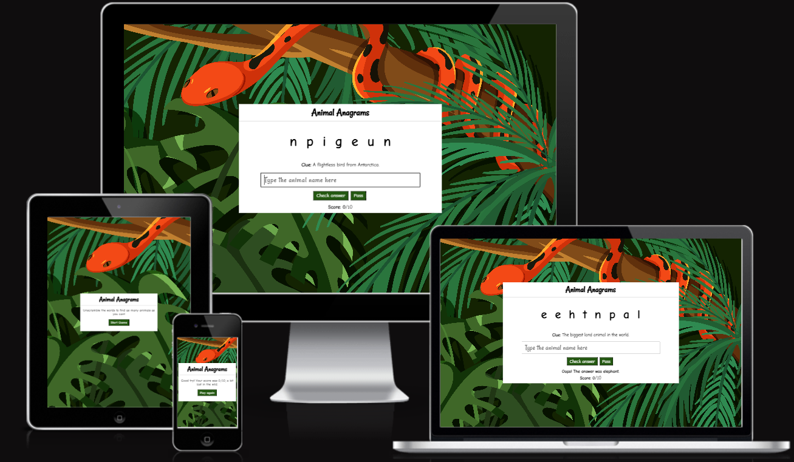
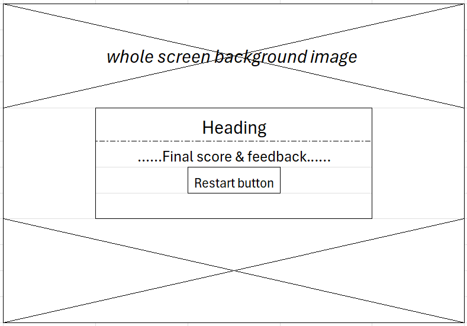
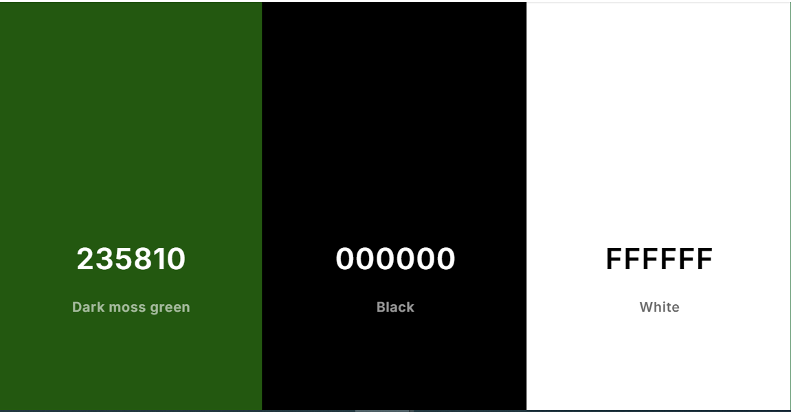
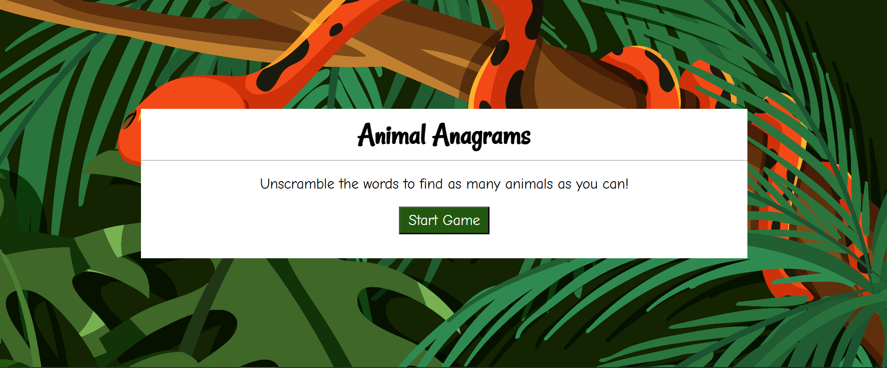
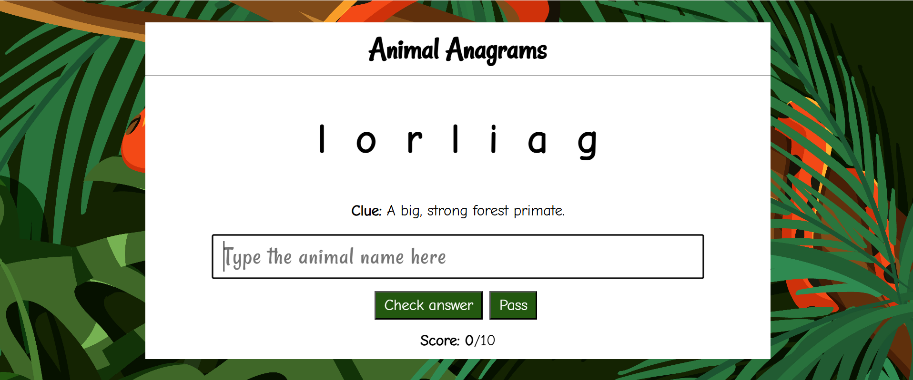
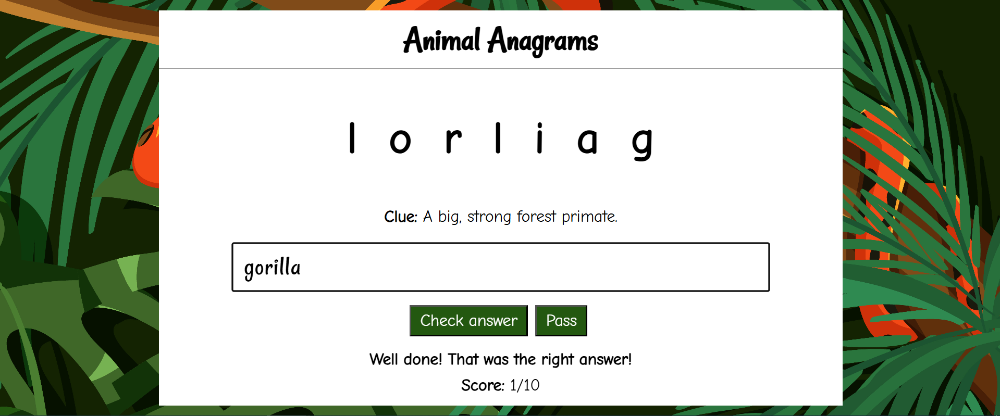
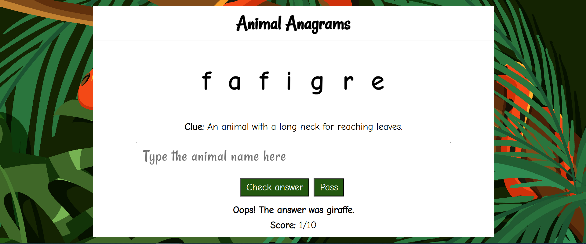
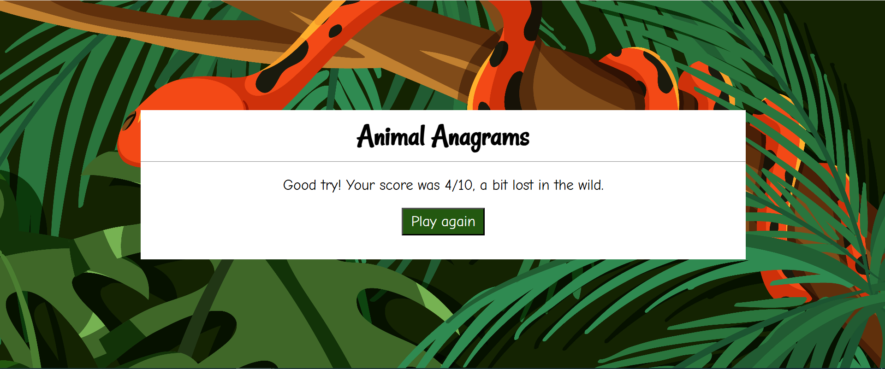
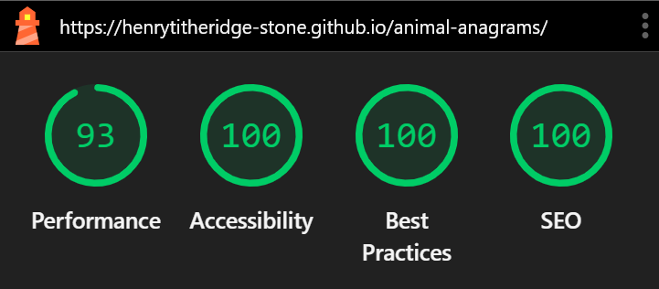
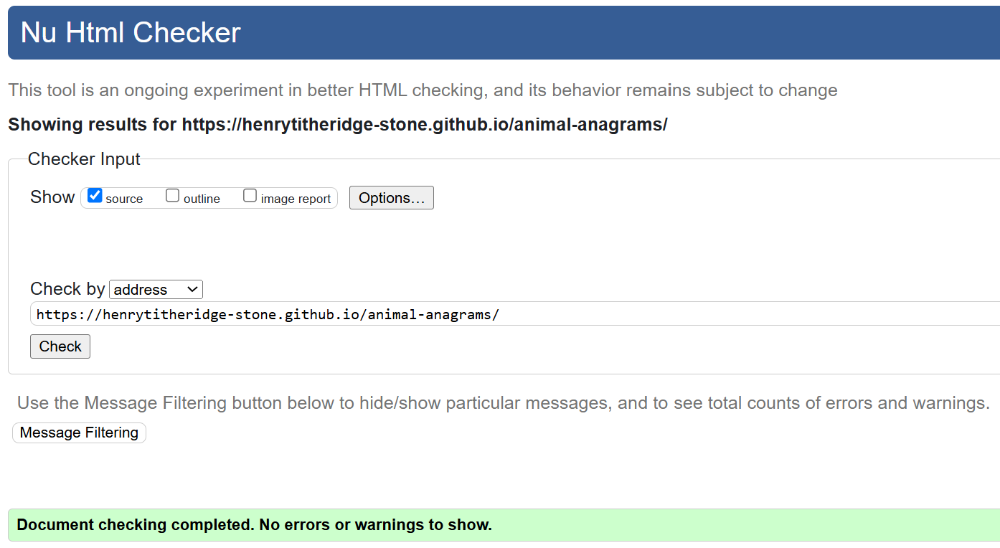

# Animal Anagrams

The Animal Anagrams site is a word unscrambling quiz page for children, teachers or parents looking for a quick, animal-themed problem-solving activity. The site challenges users to solve successive anagrams, reassembling the names of some well-known animal species. It’s a fully responsive JavaScript word game that hopes to offer users a fun critical- and creative-thinking exercise in a popular context.

Users of the site will be able to see initial instructions before starting the game, each anagram displayed in turn above a corresponding clue, an answer box to type into, clickable buttons to check their answer or pass and move on, a running score and, on completion, a feedback message with their final score.

The site is targeted at animal-loving children who enjoy puzzles and want to have fun playing a game and teachers and/or parents who want to incorporate a short, attention-grabbing, curriculum-linked problem-solving booster into a lesson, homework or general screen time.



## Design
- The game's wireframes were designed to ensure the same display on mobile or desktop devices, keeping all the foreground elements on one high-contrasting, thematically-framed and uncluttered page to keep user engagement simple, well-signposted and intuitive.
### Wireframes
#### Landing page


#### Gameplay screen


#### Final score screen


### Colours and fonts

- The colour palette features high-contrasting black and white for the majority of text/background combinations

- The hidden wildlife theme is picked up with a mossy green - chosen from the background image of an elusive snake using a Coolors tool - to highlight the buttons behind white text

- The strong contrasts highlight the content and help to guide the user experience, for example the switch to a black background demonstrating a hovered-over button can be pressed

- While the fun, bouncy 'Rancho' heading and input font feels playful and child-friendly, both this and the clearer, school-like 'Comic Neue' game container font are examples of precursive, sans-serif writing, a highly accessible prerequisite for early readers

## Website features

### Landing page
- Users are greeted by a clean, simple intro screen including an engaging, cartoonishly illustrated partly-hidden snake in a rainforest background, prominent central title in playful font and clear, succinct instructions to guide the user experience



- By clicking the high-contrasting, leafy-green, intuitively-labelled 'Start Game' button, users will hide the instructions, reveal the game area, first anagram and clue

- The click event achieves this by triggering the displayGame function. The title remains for consistency and as a top border, containing the user's focus on the game area.

- I used the following code to achieve this functionality:
```
function displayGame() {
    
    let introArea = document.querySelector(".intro-area");
    introArea.classList.add("hidden");

    let gameArea = document.querySelector(".game-area");
    gameArea.classList.remove("hidden");

    runGame();
    
}
```
### Gameplay screen
- The game area shares the intro screen's high-contrasting white background and black text, prioritising readability with the school-friendly 'Comic Neue' font used for the anagram, clue, buttons and score


#### Anagram maker
- An animal is picked at random from an array, scrambled and displayed for the user to reassemble. They are given a clue to help them succeed.

- I used the following code within a runGame function to achieve this functionality:
```  
// Choose random animal from array and split its name into an array letter by letter
    randomAnimal = animals[Math.floor(Math.random() * animals.length)];
    let animalLetters = randomAnimal.name.split("");

    // Loop and swap pairs of letters backwards as indices through the name's array
        for (let i = animalLetters.length - 1; i > 0; i--) {
        let j = Math.floor(Math.random() * (i + 1));
        [animalLetters[i], animalLetters[j]] = [animalLetters[j], animalLetters[i]];
    }

    let anagram = document.getElementById("name");
    anagram.innerText = animalLetters.join(""); // display anagram for users without commas

    let clue = document.querySelector(".clue span");
    clue.innerText = randomAnimal.clue; // display clue for users
```
#### Answer box
- The user's focus and cursor is repeatedly returned to the answer box which is also emptied after very attempt using this code within the runGame function:
```
document.getElementById("answer-box").value = ""; // always clear and select input field 
document.getElementById("answer-box").focus();
```
#### Buttons, feedback and no repeats:

- The user will be presented with ten different animal anagrams, made possible by splicing each animal from the array after it has been played before running the game again

- Placeholder instruction text in the fun 'Rancho' font and the 'Check Answer' and 'Pass' buttons clearly direct users through their steps in the game. The 'Pass' button gives users a chance to skip a word, allowing the input field to be left blank.

- The buttons display a feedback message to congratulate or inform the user of the correct answer. This remains on screen for 3 seconds to give users a chance to read it before loading the next anagram to avoid overlap.



- I used the following code to achieve this functionality:
```
function checkAnswer() {

    let userAnswer = document.getElementById("answer-box").value;
    
    if (userAnswer.toLowerCase() === randomAnimal.name) { // displays right or wrong message
        feedbackMessage.innerText = "Well done! That was the right answer!";
        incrementScore(); // adds one point for a correct answer
    } else {
        feedbackMessage.innerText = `Oops! The answer was ${randomAnimal.name}.`;
    }

    // Remove previously displayed animals in turn from the array to avoid repeats
    let randomIndex = animals.indexOf(randomAnimal);
    if (animals.length > 1) {
        animals.splice(randomIndex, 1);
        setTimeout(() => { // hide feedback and run next anagram/end game after 3s
            feedbackMessage.innerText = "";
            runGame();
        }, 3500);
    } else {
        setTimeout(() => {
            endGame();
        }, 3500);
    }

}
```
#### Running score
- The user will be able to keep track of their score throughout as it remains displayed at the bottom of the game container, consistently reminded to keep trying anagrams to get the best result


- A simple incrementScore function is triggered by entering and checking a correct answer (as shown above) so that the users will see their score going up from 0 and be motivated to engage further:
```
    let runningScore = parseInt(document.getElementById("score").innerText);
    document.getElementById("score").innerText = ++runningScore;
```
### Final score screen
- After the tenth feedback message the final score screen is displayed, showing the user their final score and an accompanying animal-themed message, intended to enhance user enjoyment and even motivate them to have another go to get a different message


#### Score bands
- For scores lower than 6, scores between 6 and 8 and scores of 9 and 10, the following code from within the endGame function (and the example screenshot above) demonstrate the three different messages users could see:
```
if (runningScore <= 5) {
        message.innerText = `Good try! Your score was ${runningScore}/10, a bit lost in the wild.`;
    } else if (runningScore <= 8) {
        message.innerText = `Great effort! Your score was ${runningScore}/10, a succesful safari!`;
    } else if (runningScore <=10) {
        message.innerText = `Incredible! Your score was ${runningScore}/10, top of the food chain!`;
    }
```
#### Play again button
- The ever-emphatic, imperative, consistent call-to-action button style brings the straightforward, step-by-step user-guided experience full circle as the 'Play again' feature nudges users into staying and continuing to interact with the game


- On clicking 'Play again' users will reload the now-familiar, original intro screen with the instructions and 'Start game' button

- Using the location.reload function in the code here made certain that the anagrams would begin to be generated from the full unspliced array of animals once again:
```
let startBtn = document.getElementById("start");
    startBtn.innerText = "Play again";
    startBtn.removeEventListener("click", displayGame); // avoids premature game reload
    startBtn.addEventListener("click", function() {
        location.reload();
    });
```
## Testing
- I tested the site extensively and in all the Chrome, Firefox and Edge browsers:

| Testing | Appearance | Functionality | Responsivity |
| ------- | ---------- | ------------- | ------------ |
| **Layout & images** | The background image displayed clearly, the game container was central as expected, the anagram and clue were above the input field with the buttons and score lined up correctly below them. | The start/end screen successfully toggled displaying with the gameplay area as per their event listeners. | Fully responsive, media queries triggered and maintained proportional layout and styles from 320px to 2560px screen-width. 
| **Fonts & colours** | The Google fonts and page styles loaded correctly and were easy to read, well contrasted and accessible. | N/A | The heading/input font, button colours and game container font were consistent across all device sizes.
| **Buttons** | All buttons appeared in the correct green behind white text, consistent in size and well-signposted for users. | On clicking, the start button successfully displayed the game area, the check answer and pass buttons displayed the correct feedback and the play again button reloaded the page. The 'Enter' key also triggered the correct feedback message as designed. | The styling, click listeners and functions of the buttons were fully responsive across all device sizes. For laptops and desktops with cursors, hovering over the buttons gave them a black background, successfully highlighting their purpose to users. 
| **Game functions** | N/A | The displayGame function was triggered by clicking the start button, hid the intro screen, revealed the game area and called the runGame function as expected. The runGame function displayed ten non-repeating, scrambled animal names in turn with their corresponding clues having cleared and selected the answer box before each user attempt. The checkAnswer function was triggered by clicking the check answer or pass buttons and successfully displayed a corresponding right/wrong message. The timeouts allowed 3 seconds to read the feedback before loading the next anagram. The incrementScore function added to the running total at the bottom of the screen after each correct answer. The endGame function was triggered after the tenth anagram, hiding the gameplay area, revealing the final score message and play again button. | All functions behaved as expected on all device screen sizes. 
| **Messages** | All messages were in the highly accessible Comic Neue font and displayed as expected in a prominent, uncluttered space. The instructions appeared as designed on the start screen, the feedback messages successfully appeared above the score and the final score message was displayed after the tenth anagram. | When an answer was entered, the 'Well done' or 'Oops!' messages were correctly displayed for 3 seconds. For scores of 5 or less the 'Good try!' message was revealed on the endGame screen, for scores of 6, 7 or 8 the 'Great effort!' message was revealed and for 9 or 10 the game returned the 'Incredible!' message. | These remained clear and engaging, fully responsive, successfully triggered and readable from screens of 320px up to 2560px width.  


- Lighthouse test mobile - homepage
 
- Lighthouse test desktop - homepage


### HTML validation

### CSS validation

### JavaScript validation
- No errors were returned when passing through the official [Jshint validator](https://jshint.com/)
    - The following metrics were returned:


## Development & Deployment

- The site was built using Visual Studio Code connected to GitHub via the steps below:
    - Created a local project folder in VS Code and a GitHub repository with the same name
    - Copied the GitHub commands to 'create a new repository on the command line'
    - Pasted and ran these through a new terminal in VS Code
        - This initialised git, made a readme file and pushed a first commit to GitHub

- Throughout the project, changes made in VS Code were regularly saved and shared by:
    - Entering 'git add .' into a terminal to stage all changes
    - Entering 'git commit -m' with a succinct summary message to commit the changes
    - Entering 'git push' to push all local changes to the project's remote GitHub repository

- The site has been deployed to GitHub Pages via the steps below:
    - Opened the settings tab in the project repository
    - Selected pages from the sidebar
    - Selected the master branch and pressed save
    - On returning to the repository there was a link provided to the hosted site

- The live link can be found here - [Animal Anagrams](https://henrytitheridge-stone.github.io/animal-anagrams/)

## Credits & acknowledgements

- Content
    - Example code taken from the Code Institute 'Love Maths' project
    - Splitting, joining, splicing, indexOf and location.reload methodologies from [W3Schools](https://www.w3schools.com/)
    - Example destructuring method to reorder letters from [Coding Nepal](https://www.codingnepalweb.com/word-scramble-game-html-javascript/)

- Media
    - The background illustration was taken from [FreePik](freepik.com)
    - The device screens preview image in the readme was generated on [Am I Responsive?](ui.dev/amiresponsive)
    - Fonts chosen in [Google Fonts](fonts.google.com)
    - Colours chosen with [Coolors](coolors.co)
    - Favicons chosen from [Favicon.io](favicon.io)

- Thanks to my Code Institute mentor, Spencer Barriball, for his support with the project
